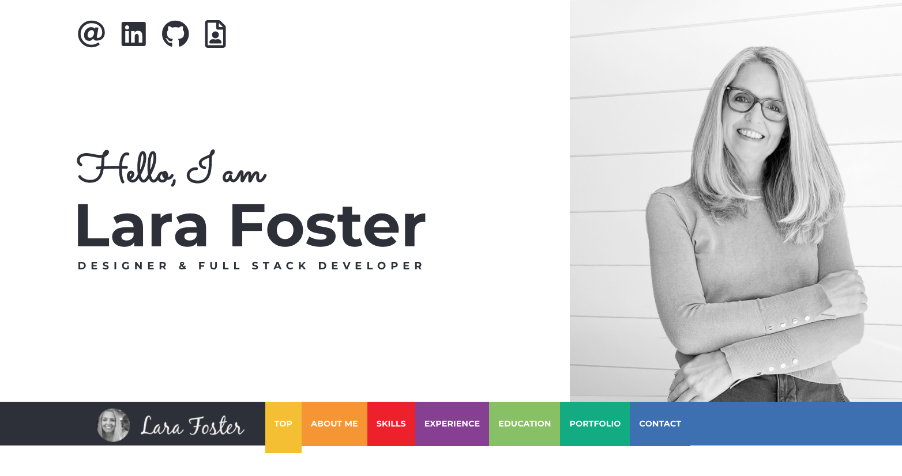

# 02 Advanced CSS: Portfolio

## Description
* Updated portfolio featuring Project 1 and two exemplary homework assignments.

* Updated GitHub profile with pinned repositories featuring Project 1 and two exemplary assignments.

* Updated resume with download in pdf

* Updated LinkedIn profile - added bootcamp info under education
### Links

[Link to the deployed website](https://larafoster.github.io/Portfolio-Project/)

[Link to the code repository](https://github.com/larafoster/Portfolio-Project)

## Installation

Upload index.html and assets folder to the deployed webserver.  
The deployed website linked above was deployed using GitHub Pages.

## Usage

Once deployed the application can be viewed in a traditional desktop web browser and it is optimized for small screens.



## User Story

```
AS AN employer
I WANT to view a potential employee's deployed portfolio of work samples
SO THAT I can review samples of their work and assess whether they're a good candidate for an open position
```

## Acceptance Criteria

Here are the critical requirements necessary to develop a portfolio that satisfies a typical hiring manager’s needs:

```
This portfolio is a work in progress: 
The following was completed:

- [x] Brief about me section
- [x] Recent photo
- [x] ID tag Links in nav
- [x] Media Queries
- [x] Image Hover States
- [x] Social profile links and icons added
```

